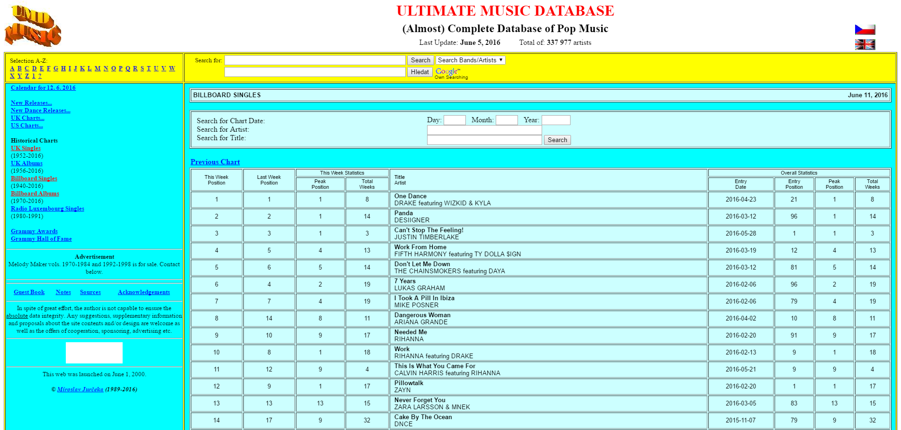
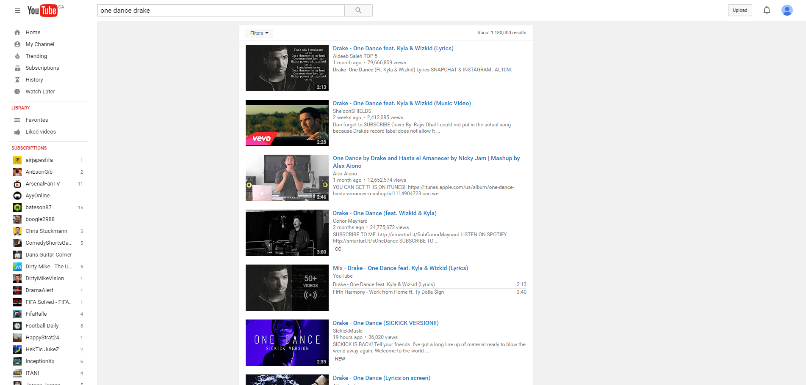
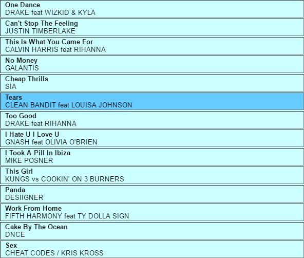
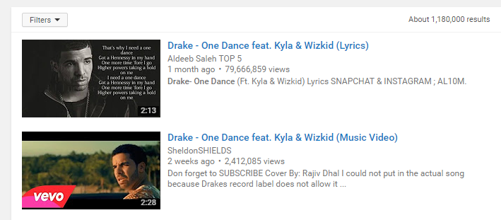
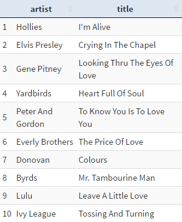
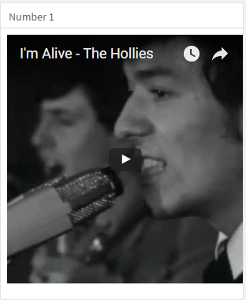

---
title: "Creating a Juke Box in Flexdashboard"
author: "Andrew Clark" 
date: "June 12, 2016"
output: 
  revealjs::revealjs_presentation:
    #theme: beige
    incremental: true
    transition: fade
    reveal_options:
      slideNumber: true
    css: styles.css
--- 


```{r setup, include=FALSE}
knitr::opts_chunk$set(echo = FALSE)
```

<!-- ## {data-background-iframe="https://mytinyshinys.shinyapps.io/musicChartsFlexDB/"}  -->


## Juke Box Features 

csstest

- Weekly Charts and Videos for decades 
- US and UK Single charts
- Artist Selection
- This week -That Year

## Major Inputs 

- [Ultimate Music Database](http://www.umdmusic.com/) 
- [flexdashboard](http://rmarkdown.rstudio.com/flexdashboard/)
- [vembedr](https://github.com/ijlyttle/vembedr) 


## Webscraping from UMD and youtube


Ultimate Music Database            |  youtube
:-------------------------:|:-------------------------:
  |  
  |  


## Initial setup

```{r cars, echo = TRUE, message=FALSE}
library(flexdashboard)

# presentation
library(plotly)
library(vembedr)
library(DT)

# processing
library(stringr)
library(lubridate)
library(dplyr)

# preprocessed data
UKcharts <- readRDS("data/UKallTime.rds")

(glimpse(UKcharts))

```


## Weekly Choice


```
inputPanel(
dateInput(
inputId="USweek",
label="Choose Saturday",
startview = "decade",
min = "1940-07-20",
value = "2016-05-28",
width = 150
)
)
```
 


## Reactive

```
chartData <- reactive({
  
theDate <- as.Date(input$week)

topTen <-  UKcharts %>%
filter(date == theDate) %>%
arrange(Position) %>%
mutate(vid = str_sub(link, 10, str_length(link))) %>%
select(Position, artist, title, vid)

})
```

## Table Output

```
output$table <- DT::renderDataTable({

chartData() %>%
      ungroup() %>% 
    arrange(Position) %>% 
select(artist, title) %>%
DT::datatable(extensions = 'Scroller',
class = 'compact stripe hover row-border order-column',
rownames = TRUE,
options = list(
paging = TRUE,
scrollY = 400, 
scroller = TRUE,
searching = FALSE,
info = FALSE
)
)
}) |
  DT::dataTableOutput("table")

```  
  
 


## Video Output

```
Row {data-height=325}
-----------------------------------------------------------------------

### Number 1

output$one <- renderUI({
  theID <- chartData()$vid[1]
   embed_youtube(id = theID,width = 300)
  })

  uiOutput("one")

```


<!-- ## CSS color background {data-background=#ff0000} -->

<!-- ## Full size image background {data-background="shinyDivRaces.png"} -->


<!-- ##  {data-background-iframe="https://mytinyshinys.shinyapps.io/worldBank/"} -->